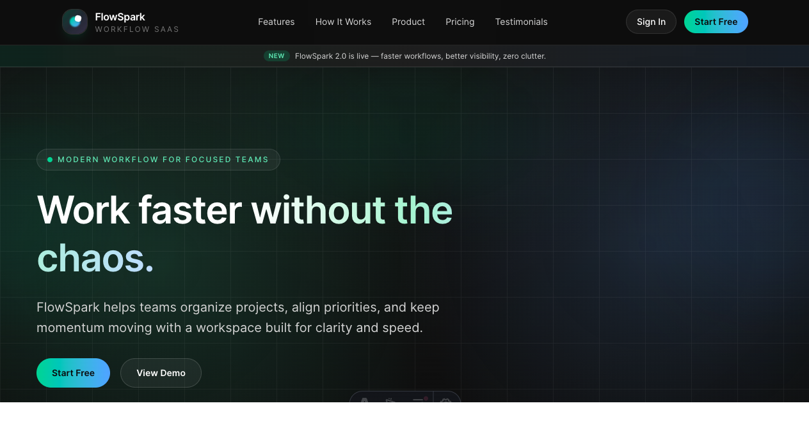
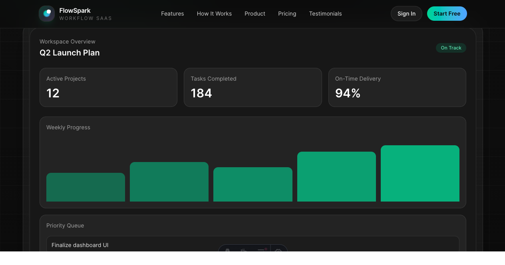
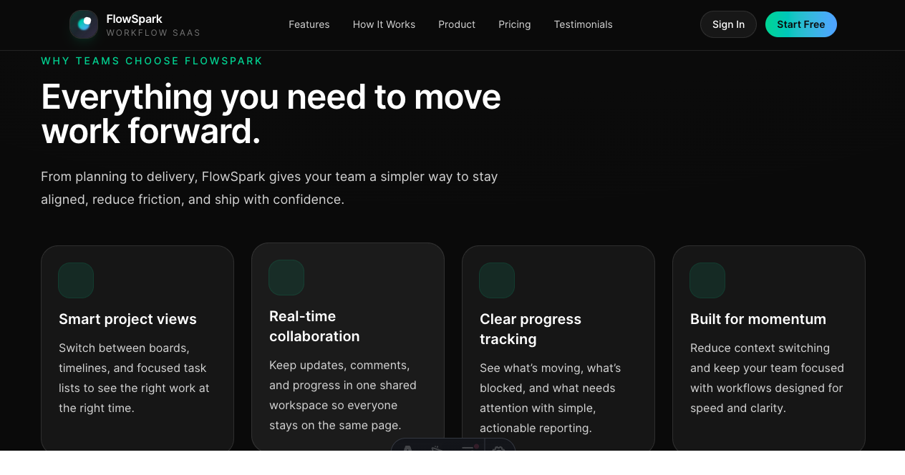
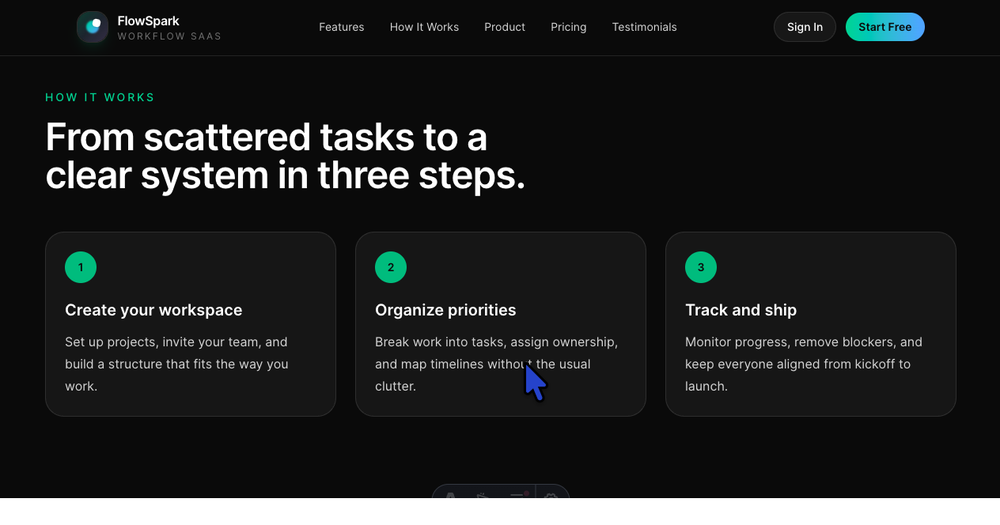
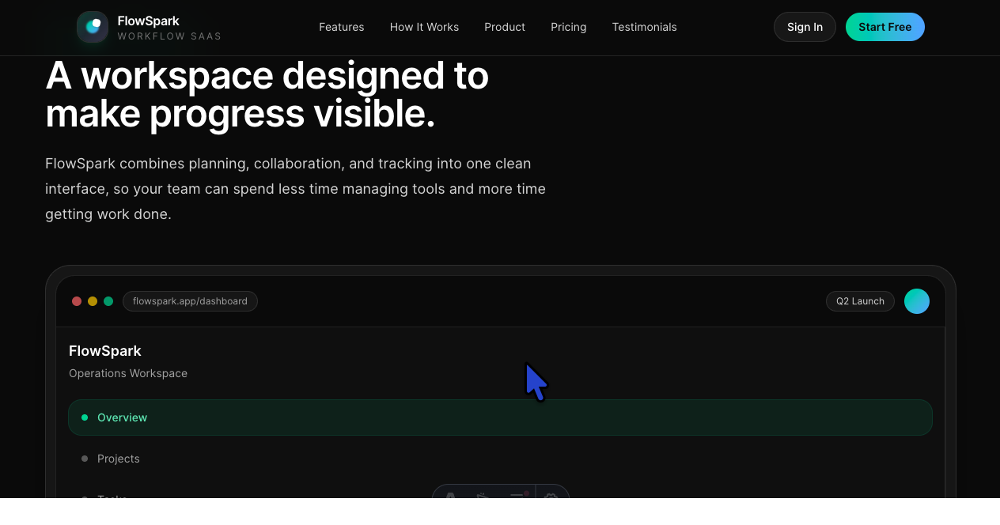

🚀 FlowSpark — Premium SaaS Landing Page

A modern, high-performance SaaS marketing site built with Astro and Tailwind CSS.

FlowSpark is a fictional workflow platform designed to showcase premium frontend execution, clean component architecture, and performance-first design.

🌐 Live Demo

👉 flow-spark-two.vercel.app

📸 Preview

✨ Overview

FlowSpark is a portfolio project focused on building a production-quality SaaS landing page that feels real, fast, and polished.

The goal was to move beyond simple UI demos and create something that reflects:

real product marketing structure
believable UI systems
modern frontend best practices
🎯 Key Features
⚡ Performance-first build with Astro
🎨 Modern UI with Tailwind CSS
🧩 Component-based architecture
📱 Fully responsive across devices
🧭 Sticky navbar with mobile menu + animated toggle
🌟 Premium hero section with gradients, glow, and CTA polish
🏢 Social proof section with brand strip and metrics
📊 Advanced dashboard-style product mockup
💳 Pricing section + dedicated /pricing page
💬 Testimonials and conversion-focused CTA sections
✨ Subtle animation system (fade, float, staggered reveals)
🧠 Tech Stack
Astro
Tailwind CSS
HTML + CSS (custom animation utilities)
Component-driven architecture
🏗️ Project Structure
src/
  components/
    AnnouncementBar.astro
    Navbar.astro
    Hero.astro
    SocialProof.astro
    Features.astro
    HowItWorks.astro
    ProductPreview.astro
    Pricing.astro
    Testimonials.astro
    CTASection.astro
    Footer.astro
    Logo.astro
  layouts/
    MainLayout.astro
  pages/
    index.astro
    pricing.astro
  styles/
    global.css
🎨 Design Approach

The design was inspired by modern SaaS companies and focused on:

Clean spacing and strong typography hierarchy
Glassmorphism-style UI panels
Subtle gradients and glow effects
Clear product storytelling through layout
Believable in-app UI (dashboard mockup)

The goal was to create something that feels like a real startup landing page, not just a demo.

⚙️ Getting Started

Clone the repo and install dependencies:

git clone https://github.com/mikedevpro/FlowSpark.git
cd flowspark
npm install
npm run dev

Then open:

http://localhost:4321
🚀 Why Astro?

I chose Astro because it allows me to:

Ship minimal JavaScript by default
Build fast, SEO-friendly marketing pages
Use components cleanly without heavy overhead
Add interactivity only where needed

This makes it perfect for landing pages, portfolios, and marketing sites.

📈 What I Learned
How to structure a real-world marketing page
How to design and build a consistent UI system
How to use Astro for performance-first frontend work
How to create reusable components for scalability
How to elevate UI from “clean” to “premium”
💡 Future Improvements
Add scroll-based animations (parallax / timing sync)
Introduce real data or API-backed sections
Convert into a reusable SaaS landing page template
Add authentication and dashboard functionality
Expand into a multi-page product site
📬 Contact

If you'd like to collaborate or have feedback, feel free to reach out!

⭐ If you like this project

Give it a star ⭐ — it helps a lot!
